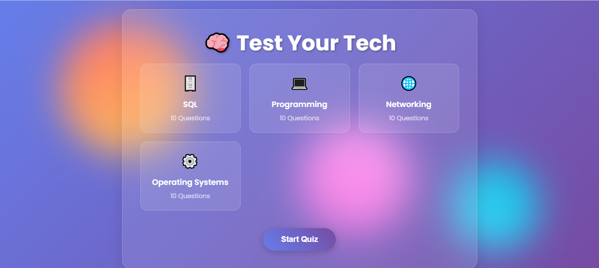

# Quiz Website



## Overview

This project is a **Quiz Website** built using **HTML, CSS, and JavaScript**. It features a `questions.js` file which includes 10 questions each from the topics:

- SQL
- Programming (C++)
- Networking and Operating Systems (OS)

The website uses a modern **card-based layout** with a **glassmorphism design** style for a clean and stylish user interface.

---

## Tech Stack

- **HTML** - Structure of the web pages  
- **CSS** - Styling including glassmorphism effects and responsive design  
- **JavaScript** - Quiz logic, timer, and dynamic question handling  

---

## Features

- Multiple-choice questions divided by topic.
- Timer for each question to add a time challenge.
- Smooth transitions between questions.
- Glassmorphed card UI to highlight the quiz content.
- Responsive design for desktop and mobile devices.
- Questions and answers are loaded dynamically from the `questions.js` file.

---

## How to Use

1. Clone the repository:
   ```bash
   git clone https://github.com/ashish0719/Quiz-Website.git
